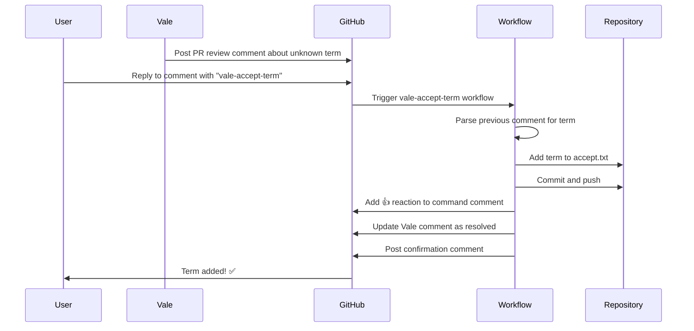

# Vale Accept Term Automation

## Overview

This automation allows PR reviewers and contributors to quickly add technical terms to the Vale accept list by simply replying to Vale error comments with `vale-accept-term`.

## How It Works

### User Flow



### Workflow Steps

1. **Trigger**: Listens for `issue_comment` and `pull_request_review_comment` events on PRs
2. **Command Detection**: Checks if comment starts with `vale-accept-term`
3. **Term Identification**:
   - If custom term provided: Uses the term from the command (e.g., `vale-accept-term CustomTerm`)
   - If no custom term: Extracts term from parent comment automatically
4. **Parent Comment Resolution** (only when auto-extracting):
   - For review comments: Uses `in_reply_to_id` to find the parent comment in the thread
   - For issue comments: Looks at the chronologically previous comment
5. **File Update**: Adds term to `.github/styles/config/vocabularies/Calculinux/accept.txt`
6. **Commit & Push**: Commits the change to the PR branch
7. **Confirmation**: Posts a success message
8. **Reaction**: Adds a green checkmark (👍) reaction to the command comment
9. **Resolution**: Updates the Vale review comment to mark it as resolved (when applicable)

## Command

### Basic Usage

Reply to any Vale error comment with one of these formats:

#### Option 1: Auto-extract from parent comment

- `vale-accept-term`

The workflow will automatically extract the term from the Vale error comment you're replying to.

#### Option 2: Specify custom term

- `vale-accept-term CustomTerm`
- `vale-accept-term SomeAcronym`
- `vale-accept-term (?i)pattern` (for case-insensitive regex patterns)

Provide the term or regex pattern you want to add directly in the command.

### Examples

```markdown
# Example 1: Auto-extract
Vale error: Unknown word: 'Calculinux'
Reply: vale-accept-term
→ Adds "Calculinux" to accept list

# Example 2: Custom term
Vale error: (any error or even no error)
Reply: vale-accept-term MyCustomTerm
→ Adds "MyCustomTerm" to accept list

# Example 3: Regex pattern
Reply: vale-accept-term (?i)mongodb
→ Adds "(?i)mongodb" (case-insensitive match) to accept list
```

**Note**: The command trigger is case-insensitive, but the term you provide preserves its exact case and format.

## Term Extraction Patterns

When using `vale-accept-term` without a custom term, the workflow automatically extracts terms from Vale error comments in these formats:

- `'term'` - Single quotes
- `"term"` - Double quotes
- `**term**` - Bold markdown
- `` `term` `` - Code backticks
- `Unknown word: term`
- `Did you really mean 'term'?`

## Files Modified

- `.github/workflows/vale-accept-term.yml` - Main workflow
- `.github/styles/config/vocabularies/Calculinux/accept.txt` - Accept list
- `.github/pull_request_template.md` - PR template with instructions
- `.github/styles/config/vocabularies/README.md` - Documentation
- `README.md` - Updated contributing section

## Security Considerations

- Only works on PR comments (not standalone issues)
- Requires `contents: write` permission to commit
- Uses `github-actions[bot]` as committer
- Includes co-author attribution to the commenting user
- Validates that the previous comment is from Vale

## Testing

To test this feature:

**Test auto-extraction:**

1. Create a PR with a file containing an unknown term
2. Wait for Vale to flag it in a review comment
3. Reply to that comment with `vale-accept-term`
4. Verify the workflow runs and commits the term

**Test custom term:**

1. On any PR, post a comment: `vale-accept-term MyCustomTerm`
2. Verify the workflow adds "MyCustomTerm" to the accept list
3. Test with regex: `vale-accept-term (?i)pattern`

## Limitations

- When auto-extracting: Requires replying to a Vale error comment with recognizable term patterns
- Single term per command (for multiple terms, use the command multiple times)
- Custom terms are added as-is without validation (ensure correct spelling and format)

## Technical Details

### Comment Thread Resolution

The workflow uses different strategies for finding the parent comment:

**Review Comments (line-specific comments on PR diffs):**

- Uses GitHub's `in_reply_to_id` field to directly identify the parent comment
- This ensures the correct Vale error is identified even when multiple review threads exist
- More reliable and efficient than searching through all comments

**Issue Comments (general PR comments):**

- Fetches all issue comments and finds the chronologically previous one
- Works well for linear comment threads
- Sufficient for issue-level comments which are naturally sequential

## Future Enhancements

Possible improvements:

- Support for adding terms with specific case patterns (e.g., `(?i)term`)
- Ability to add to other vocabularies (Yocto, OpenSource)
- Support for phrase extraction (multi-word terms)
- Interactive confirmation before committing
- Batch add multiple terms from a single command

## Related Files

- Workflow: [vale-accept-term.yml](vale-accept-term.yml)
- Accept list: [vocabularies/Calculinux/accept.txt](../styles/config/vocabularies/Calculinux/accept.txt)
- Vale config: [.vale.ini](../../.vale.ini)
- Main PR checks: [markdown-check.yml](markdown-check.yml)
