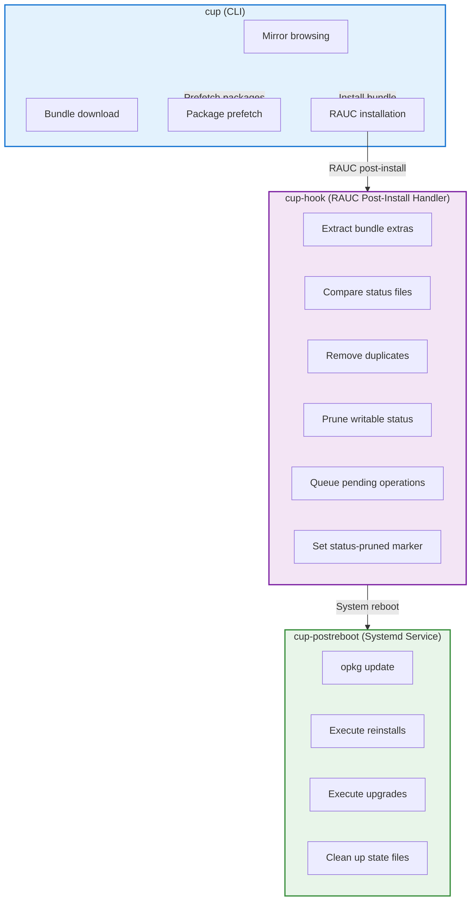

# Calculinux Update System

Developer documentation for the `calculinux-update` package and OPKG
reconciliation system.

## Architecture Overview

The Calculinux update system consists of three main components that work
together to provide atomic A/B updates with automatic package reconciliation:



**Key Architectural Principle**: The hook performs ALL reconciliation planning
and preparation (including status pruning and duplicate removal) BEFORE reboot.
The post-reboot service contains NO reconciliation logic - it purely executes
the plan created by the hook.

## Module Structure

```
src/calculinux_update/
├── cli.py              # Main CLI entry point (cup command)
├── config.py           # Configuration file parsing
├── mirror.py           # Mirror browsing and bundle listing
├── installer.py        # RAUC installation and coordination
├── bundle.py           # Bundle extras extraction
├── prefetch.py         # Package prefetch before update
├── hooks.py            # RAUC hook and post-reboot entry points
└── opkg/
    ├── status.py       # OPKG status file parser
    ├── reconcile.py    # Reconciliation algorithm
    └── overlayfs.py    # OverlayFS whiteout cleanup
```

**New in v0.5.1**: `overlayfs.py` module provides comprehensive OverlayFS
whiteout management:

- `cleanup_package_whiteouts()` - Remove package file whiteouts
- `cleanup_opkg_metadata_whiteouts()` - Remove metadata whiteouts in
  `/var/lib/opkg/info/`
- `has_files_in_upper()` - Detect if package has files in upper layer (for
  two-phase duplicate removal)
- `is_package_in_writable_status()` - Uses enhanced opkg `--writable-only` flag
  with fallback
- `remount_overlayfs()` - Remount overlay to pick up whiteout changes

**Binary Locations** (as of v0.5.0):

- `/usr/bin/cup` - User-facing CLI command
- `/usr/lib/calculinux-update/cup-hook` - RAUC hook (internal, called by
  post-install handler)
- `/usr/lib/calculinux-update/cup-postreboot` - Post-reboot service entry point
  (internal, called by systemd)

System-internal binaries are now in `/usr/lib/calculinux-update/` to clarify
they are not meant for direct user invocation.

## Bundle Extras

### Overview

RAUC bundles can include additional files beyond the root filesystem image.
Calculinux bundles include a `bundle-extras.tar.gz` file containing OPKG
configuration and package status information from the new image. This enables
the prefetch system to work correctly.

### Bundle Structure

```
bundle.raucb (squashfs)
├── manifest.raucb      # RAUC manifest
├── rootfs.img          # Root filesystem image
└── bundle-extras.tar.gz
    └── extras/
        └── opkg/
            ├── etc/
            │   └── opkg/
            │       ├── opkg.conf
            │       └── *.conf
            └── status.image
```

### Extraction Process

**Module**: `bundle.py`

The `extract_bundle_extras()` function performs a two-stage extraction:

1. **Extract tarball from bundle** - Uses `unsquashfs` to extract
   `bundle-extras.tar.gz` from the squashfs bundle
2. **Extract tarball contents** - Uses Python's `tarfile` module to extract the
   `extras/` directory structure

```python
def extract_bundle_extras(bundle_path: Path) -> Optional[BundleExtras]:
    """Extract Calculinux-specific extras from a RAUC bundle.

    Returns None when extras are missing. The caller is responsible for calling
    ``cleanup`` on the returned BundleExtras once finished with the temporary
    directory.
    """
    # Stage 1: Extract tarball from bundle
    subprocess.run([
        "unsquashfs", "-f", "-d", str(temp_dir),
        str(bundle_path), "bundle-extras.tar.gz"
    ])

    # Stage 2: Extract tarball contents
    with tarfile.open(tarball_path, "r:gz") as tar:
        tar.extractall(path=temp_dir, filter="data")

    # Validate and return
    if not (temp_dir / "extras/opkg/status.image").exists():
        return None

    return BundleExtras(root=temp_dir, opkg_root=temp_dir / "extras/opkg", ...)
```

**Security**: The extraction uses `filter="data"` (Python 3.13+) to prevent path
traversal attacks.

### Bundle Extras Creation

**Yocto Recipe**:
`meta-calculinux-distro/recipes-core/image/calculinux-image.bb`

The `calculinux_export_bundle_extras()` function runs during `do_rootfs`:

```bash
calculinux_export_bundle_extras() {
    extras_dir="${DEPLOY_DIR_IMAGE}/bundle-extras/extras/opkg"

    # Export OPKG configuration
    if [ -d "${IMAGE_ROOTFS}/etc/opkg" ]; then
        install -d "${extras_dir}/etc"
        cp -r "${IMAGE_ROOTFS}/etc/opkg" "${extras_dir}/etc/"
    fi

    # Export image status file
    if [ -f "${IMAGE_ROOTFS}/var/lib/opkg/status.image" ]; then
        install -d "${extras_dir}"
        install -m 0644 "${IMAGE_ROOTFS}/var/lib/opkg/status.image" \
            "${extras_dir}/status.image"
    fi

    # Create tarball only if we have data
    if [ "$has_data" = "1" ]; then
        tar -czf "${DEPLOY_DIR_IMAGE}/bundle-extras.tar.gz" \
            -C "${DEPLOY_DIR_IMAGE}/bundle-extras" extras
    fi
}
```

**Bundle Recipe**:
`meta-calculinux-distro/recipes-core/bundles/calculinux-bundle.bb`

```bitbake
inherit bundle

RAUC_BUNDLE_EXTRA_FILES += "bundle-extras.tar.gz"
```

The `bundle` class automatically includes files listed in
`RAUC_BUNDLE_EXTRA_FILES` from `DEPLOY_DIR_IMAGE`.

### Why Bundle Extras?

Without bundle extras, the hook would need to:

1. ~~Mount the inactive slot after RAUC installation~~ ✗ Not possible - RAUC
   unmounts slots after installation
2. ~~Access the filesystem to read OPKG configuration~~ ✗ Slot no longer mounted
   when hook runs
3. ~~Deal with potential mounting failures or filesystem issues~~ ✗ Additional
   complexity and failure modes

With bundle extras:

✅ Self-contained: Bundle includes all necessary metadata  
✅ No mounting required: Status file provided via environment variable  
✅ Hook runs without slot access: Works even if slot can't be mounted  
✅ Faster: No filesystem access delays  
✅ More reliable: Fewer moving parts, fewer failure modes

**Critical for v0.5.0+**: The hook now receives `RAUC_BUNDLE_STATUS_IMAGE` from
the post-install handler, which extracts `status.image` from bundle extras. The
hook NO LONGER MOUNTS SLOTS - it relies entirely on bundle extras for the new
image's package status.

### Error Handling

If bundle extras are missing or corrupted:

```python
extras = extract_bundle_extras(bundle_path)
if not extras:
    # Graceful degradation - skip prefetch
    console.print("[yellow]Bundle extras missing, skipping prefetch[/]")
    # Installation continues normally
```

The update installation continues without prefetch, but post-reboot
reconciliation will require network access.

## OPKG Reconciliation System

### The Problem

Calculinux uses a dual-layer package system:

- **Base layer**: Read-only packages in the RAUC image
  (`/var/lib/opkg/status.image`)
- **Overlay layer**: User-installed packages in writable storage
  (`/var/lib/opkg/status`)

When updating the base image, three problems arise:

1. **Shadowing**: Packages installed in overlay that now exist in the new base
   (duplicates)
2. **Missing packages**: Packages removed from new base that overlay packages
   depend on
3. **Version conflicts**: Overlay packages built against old base versions

### The Solution

The reconciliation system solves this in two main phases plus an optional
prefetch:

#### Phase 0: Prefetch (Optional, Before Update)

**Module**: `prefetch.py`, `bundle.py`

```python
def prefetch_for_bundle(
    bundle_path: str,
    bundle_sha256: str,
    console: Optional[Console] = None
) -> PrefetchResult:
    """Pre-download packages needed for reconciliation."""
```

**Process**:

1. Extract bundle extras from the RAUC bundle
2. Load OPKG configuration and status.image from extras
3. Compute reconciliation plan against current writable status and current
   slot's status.image
4. Download all packages marked for reinstall using bundle's OPKG config
5. Cache packages in `/var/cache/calculinux-update/prefetch/`

**Key Implementation**:

```python
# Extract bundle extras
extras = extract_bundle_extras(bundle_path)
if not extras:
    return PrefetchResult(skipped=True, reason="bundle extras missing")

# Require current slot to have status.image (all Calculinux images have this)
if not CURRENT_IMAGE_STATUS.exists():
    return PrefetchResult(skipped=True, reason="current image too old")

# Use extras to configure opkg downloader
downloader = OpkgDownloader(extras.opkg_root)
downloaded = downloader.download(plan.reinstall, PREFETCH_CACHE_DIR)
```

**Benefits**:

- No need to mount slots
- Self-contained: All metadata in the bundle
- Offline reconciliation capability (if prefetch succeeds)
- Faster post-reboot (packages already cached)
- Handles network unavailability during reboot

**Note**: Prefetch is OPTIONAL. If it fails or is skipped (--no-prefetch), the
update still proceeds normally. Network access is required after reboot if
prefetch didn't cache packages.

#### Phase 1: Hook (During RAUC Install) - THE BRAIN

**Module**: `hooks.py` → `run_slot_hook()`

**RAUC Integration** (v0.5.0+):

```bash
# /usr/lib/rauc/post-install-handler.sh
BUNDLE_STATUS_IMAGE="${RAUC_BUNDLE_MOUNT_POINT}/extras/opkg/status.image"

export RAUC_BUNDLE_STATUS_IMAGE="${BUNDLE_STATUS_IMAGE}"
export RAUC_SLOT_CLASS="rootfs"
export RAUC_SLOT_NAME="${SLOT_NAME}"

/usr/lib/calculinux-update/cup-hook slot-post-install "${SLOT_NAME}"
```

**Critical Change in v0.5.0**: The hook NO LONGER MOUNTS SLOTS. It receives the
status.image file path from bundle extras via the `RAUC_BUNDLE_STATUS_IMAGE`
environment variable.

**Process** (ALL happens before reboot):

1. Validate environment (`RAUC_SLOT_CLASS=rootfs`, `RAUC_BUNDLE_STATUS_IMAGE`
   provided)
2. Load status files:
   - New image status from `RAUC_BUNDLE_STATUS_IMAGE` (bundle extras)
   - Current writable status from `/var/lib/opkg/status`
   - Current image status from `/var/lib/opkg/status.image`
3. Compute reconciliation plan (what needs to change)
4. **Two-phase duplicate removal**:
   - **Status-only duplicates**: Packages with no actual files in the upper
     layer are removed from status file immediately (safe before reboot)
   - **Physical duplicates**: Packages with actual files in the upper layer are
     queued for removal after reboot
5. **Clean up OverlayFS whiteouts** for status-only duplicates:
   - Pre-fetch file lists before package removal
   - Remove package file whiteouts (character device 0:0)
   - Remove metadata whiteouts in `/var/lib/opkg/info/`
   - Remount overlay to pick up changes
6. **Queue pending operations**:
   - Write `/var/lib/calculinux-update/update-state.pending-duplicates`
     (physical duplicates for post-reboot)
   - Write `/var/lib/calculinux-update/update-state.pending-reinstalls`
   - Write `/var/lib/calculinux-update/update-state.pending-upgrades`
7. **Set completion marker** - `/var/lib/calculinux-update/status-pruned`

**Key Implementation** (v0.5.0):

```python
def run_slot_hook(hook: str, slot: str) -> None:
    """RAUC hook for slot-post-install phase."""

    # 1. Get status.image from bundle extras (via environment)
    bundle_status_image = os.environ.get("RAUC_BUNDLE_STATUS_IMAGE")
    if not bundle_status_image:
        LOG.warning("RAUC_BUNDLE_STATUS_IMAGE not provided")
        return

    image_status = Path(bundle_status_image)
    if not image_status.exists():
        LOG.warning("bundle status image missing")
        return

    # 2. Require current image to have status.image
    if not CURRENT_IMAGE_STATUS.exists():
        LOG.error("current image too old - missing status.image")
        raise SystemExit(1)

    # 3. Compute reconciliation plan
    plan = compute_reconcile_plan(
        image_status=image_status,
        writable_status=WRITABLE_STATUS,
        current_status=CURRENT_IMAGE_STATUS,
    )

    # 4. Remove status-only duplicates immediately (safe)
    _prune_status_only_duplicates(plan.status_only_duplicates)

    # 5. Queue physical duplicates for post-reboot removal
    _write_pending(PENDING_DUPLICATES_FILE, plan.duplicates, "physical duplicates")

    # 6. Queue pending operations
    _write_pending(PENDING_REINSTALL_FILE, plan.reinstall, "reinstall")
    _write_pending(PENDING_UPGRADE_FILE, plan.upgrade, "upgrade")

    # 7. Mark status as pruned
    _atomic_write(STATUS_PRUNED_MARKER, "pruned\n")
```

**Why Two-Phase Duplicate Removal?**:

- **Status-only duplicates**: Packages that exist only in the status file but
  have no actual files in the upper layer can be safely removed immediately.
  Removing them before reboot is safe because they don't have any files that
  could temporarily break system access.
- **Physical duplicates**: Packages with actual files in the upper layer must be
  removed after reboot. If removed before reboot, OverlayFS creates whiteout
  files for ALL package files. If a second update follows immediately, these
  whiteouts temporarily hide critical libraries from the base image, potentially
  breaking system access during the update window.
- **Example**: User installs SDL → Update 1 includes SDL in base → Update 2
  follows immediately. If SDL is removed before reboot in Update 1, whiteouts
  hide SDL libraries during Update 2, breaking any program that needs SDL.

**OverlayFS Whiteout Cleanup**:

The hook cleans up two types of whiteouts after removing status-only duplicates:

1. **Package File Whiteouts**:
   - Pre-fetches file list for each package BEFORE `opkg remove` (removal
     deletes from database)
   - After removal, checks each file path for whiteout files (character device
     0:0)
   - Removes whiteouts to expose base image files
   - Uses enhanced opkg `--writable-only` flag to verify package removal

2. **Metadata Whiteouts**:
   - Scans `/var/lib/opkg/info/` for `.wh.package.*` files
   - Removes whiteouts that hide base image metadata files (`.list`, `.control`,
     etc.)
   - Allows `opkg files package` queries to work correctly

3. **Remount Overlay**:
   - After whiteout cleanup, remounts overlay to pick up changes immediately
   - Ensures base image files are accessible right away

#### Phase 2: Post-Reboot (After Slot Switch) - THE EXECUTOR

**Module**: `hooks.py` → `postreboot_entrypoint()`

**Systemd Integration** (v0.5.0):

```ini
# /usr/lib/systemd/system/cup-postreboot.service
[Unit]
Description=Calculinux post-reboot package reconciliation
Wants=network-online.target
After=network-online.target
# Run if there are pending operations OR status needs pruning
ConditionPathExists=|/var/lib/calculinux-update/update-state.pending-reinstalls
ConditionPathExists=|/var/lib/calculinux-update/update-state.pending-upgrades
ConditionPathExists=|!/var/lib/calculinux-update/status-pruned

[Service]
Type=oneshot
ExecStart=/usr/lib/calculinux-update/cup-postreboot

[Install]
WantedBy=multi-user.target
```

**Critical Change in v0.5.0**: The post-reboot service contains ZERO
reconciliation logic. It ONLY executes the plan created by the hook.

**Process** (Simple execution only):

1. Checks for pending operations (triggered by systemd conditions)
2. **Removes physical duplicate packages** queued by hook (with whiteout
   cleanup)
3. Updates opkg package feeds (`opkg update`)
4. Executes pending reinstalls (preferring cached .ipk files)
5. Executes pending upgrades
6. Cleans up state files

**Key Implementation** (v0.5.0):

```python
def postreboot_entrypoint() -> int:
    """Post-reboot package reconciliation - pure execution."""

    # Check for rollback (skip if we rolled back)
    if _handle_rollback():
        return 0

    # If no pending operations, we're done
    has_pending = (PENDING_REINSTALL_FILE.exists() or
                   PENDING_UPGRADE_FILE.exists() or
                   PENDING_DUPLICATES_FILE.exists())
    if not has_pending:
        LOG.info("no pending operations")
        return 0

    # Remove physical duplicates first (queued from hook)
    if PENDING_DUPLICATES_FILE.exists():
        if not _process_pending(PENDING_DUPLICATES_FILE, _remove_duplicate_pkg):
            LOG.warning("some duplicate removals failed")
            # Continue anyway

    # Update feeds
    if not _run_opkg(["update"]):
        LOG.error("opkg update failed")
        return 1

    # Execute reinstalls
    if not _process_pending(PENDING_REINSTALL_FILE, _install_reinstall_pkg):
        LOG.warning("some reinstalls failed, leaving pending file for retry")
        # Continue anyway

    # Execute upgrades
    if not _process_pending(PENDING_UPGRADE_FILE, _upgrade_pkg):
        LOG.warning("some upgrades failed, leaving pending file for retry")
        # Continue anyway

    LOG.info("post-reboot reconciliation complete")
    return 0
```

**What Changed from v0.4.x**:

- ❌ Removed: Duplicate status pruning logic (now in hook only)
- ❌ Removed: Writable status manipulation (now in hook only)
- ❌ Removed: Reconciliation planning (now in hook only)
- ✅ Kept: Package feed updates
- ✅ Kept: Package installation/upgrade execution
- ✅ Kept: Rollback detection

**Cache Preference**: The system prefers prefetched `.ipk` files from
`/var/cache/calculinux-update/prefetch/` for offline operation:

```python
def _install_reinstall_pkg(pkg: str) -> bool:
    cached = _find_cached_package(pkg)
    if cached:
        LOG.info("reinstalling %s from cache", pkg)
        return _run_opkg(["install", "--force-reinstall", str(cached)])
    else:
        LOG.info("reinstalling %s from feed", pkg)
        return _run_opkg(["install", "--force-reinstall", pkg])
```

### Reconciliation Algorithm

**Module**: `reconcile.py`

**Core Function**:

```python
@dataclass
class ReconcilePlan:
    """Plan for reconciling overlay packages with new base image."""
    status_only_duplicates: List[str]  # Duplicates safe to remove immediately
    duplicates: List[str]              # Physical duplicates (deferred to post-reboot)
    reinstall: List[str]               # Missing packages to reinstall
    upgrade: List[str]                 # Overlay packages to upgrade

def compute_reconcile_plan(
    image_status: Path,
    writable_status: Path,
    current_status: Path,
) -> ReconcilePlan:
    """Compute what needs to change in writable status."""
```

**Algorithm**:

1. **Identify all duplicates** - packages in both writable and new image:

   ```python
   writable_pkgs = {e["Package"] for e in load_status_entries(writable_status)}
   new_image_pkgs = {e["Package"] for e in load_status_entries(image_status)}
   all_duplicates = list(writable_pkgs & new_image_pkgs)
   ```

2. **Split duplicates into two phases** - based on upper layer presence:

   ```python
   status_only_duplicates = []
   physical_duplicates = []

   for pkg in all_duplicates:
       if has_files_in_upper(pkg):
           # Has actual files - defer to post-reboot
           physical_duplicates.append(pkg)
       else:
           # Status-only - safe to remove now
           status_only_duplicates.append(pkg)
   ```

3. **Find missing packages** - packages removed from new image:

   ```python
   old_image_pkgs = {e["Package"] for e in load_status_entries(current_status)}
   missing_from_new = old_image_pkgs - new_image_pkgs

   # Only reinstall if writable packages depend on them
   reinstall = []
   for pkg in missing_from_new:
       if any(pkg in get_dependencies(w) for w in writable_status):
           reinstall.append(pkg)
   ```

4. **Identify upgrades needed** - overlay packages that may conflict:
   ```python
   upgrade_packages = []
   for entry in load_status_entries(writable_status):
       pkg_name = entry["Package"]
       if pkg_name not in all_duplicates:  # Not a duplicate
           upgrade_packages.append(pkg_name)
   ```

**Why upgrade everything?**: Overlay packages were compiled against the old
base. The new base may have updated shared libraries or APIs. Upgrading ensures
ABI compatibility.

### Status File Parsing

**Module**: `status.py`

**Format**: OPKG status files use a paragraph-based format (like Debian control
files):

```
Package: foo
Version: 1.0-r0
Depends: libbar (>= 2.0)
Status: install user installed
Architecture: cortexa9t2hf-neon

Package: bar
...
```

**Key Functions**:

```python
def load_status_entries(status_path: str) -> List[StatusEntry]:
    """Parse status file into list of package entries."""
    # Returns list of dicts, one per package

def write_status_entries(status_path: str, entries: List[StatusEntry]) -> None:
    """Write entries back to status file."""
    # Preserves original format and field order

def _iter_paragraphs(file: TextIO) -> Iterator[List[str]]:
    """Iterate over paragraph blocks in status file."""
    # Handles blank lines, comments, continuations
```

**Robustness**:

- Handles missing files (returns empty list)
- Preserves field order when round-tripping
- Respects blank lines between entries
- Case-insensitive field lookup

## Configuration

**Module**: `config.py`

**File**: `/etc/calculinux-update.toml`

```python
@dataclass
class ChannelConfig:
    name: str
    path: str
    enable: bool = True

@dataclass
class AppConfig:
    mirror_base_url: str
    channels: List[ChannelConfig]
    cache_dir: str = "/var/cache/calculinux-update"

def load_config() -> AppConfig:
    """Load config from /etc or fallback to package defaults."""
```

**Configuration Resolution**:

1. Try `/etc/calculinux-update.toml` (system config)
2. Fall back to `src/calculinux_update/defaults/calculinux-update.toml`
3. Merge channels (system config channels override defaults by name)

## Mirror Browsing

**Module**: `mirror.py`

**Structure**:

```python
@dataclass
class BundleInfo:
    filename: str
    timestamp: datetime
    size: int
    sha256: Optional[str] = None

def list_bundles_for_channel(
    channel: ChannelConfig,
    base_url: str
) -> List[BundleInfo]:
    """List available bundles from mirror channel."""
    # Fetches channel/bundles.txt
    # Parses bundle metadata
    # Sorts by timestamp (newest first)
```

**Bundles Metadata** (`bundles.txt`):

```
# timestamp filename size sha256
1732147200 calculinux-bundle-20241120.raucb 123456789 abc123...
1731542400 calculinux-bundle-20241113.raucb 123456780 def456...
```

**Download**:

```python
def download_bundle(
    bundle: BundleInfo,
    channel: ChannelConfig,
    base_url: str,
    destination: str,
    verify_checksum: bool = True
) -> bool:
    """Download bundle from mirror with optional verification."""
```

## Installation Flow

**Module**: `installer.py`

**Main Orchestrator**:

```python
def install_update_interactive(
    config: AppConfig,
    channel_name: Optional[str] = None,
    bundle_name: Optional[str] = None,
    dry_run: bool = False,
    prefetch: bool = True,
    require_confirmation: bool = True
) -> bool:
    """Interactive update installation with prefetch."""
```

**Process**:

1. **Select channel** - prompt if not specified
2. **List bundles** - from mirror, sorted newest first
3. **Select bundle** - prompt if not specified
4. **Prefetch packages** - if enabled and not dry-run
5. **Download bundle** - to cache directory
6. **Confirm installation** - if required
7. **Invoke RAUC** - `rauc install <bundle>`

**RAUC Integration**:

```python
def install_with_rauc(bundle_path: str) -> bool:
    """Install bundle using RAUC."""
    result = subprocess.run(
        ["rauc", "install", bundle_path],
        capture_output=True,
        text=True
    )
    return result.returncode == 0
```

## Testing

### Test Structure

```
tests/
├── test_cli.py             # CLI argument parsing and commands
├── test_config.py          # Configuration loading
├── test_mirror.py          # Mirror browsing and downloads
├── test_installer.py       # Installation orchestration
├── test_opkg_status.py     # Status file parsing
├── test_opkg_reconcile.py  # Reconciliation algorithm
├── test_hooks.py           # Hook and post-reboot logic
└── test_prefetch.py        # Package prefetch
```

### Key Testing Principles

**Avoid Brittleness**:

```python
# ❌ BAD: Too specific, fragile
def test_find_booted_device(mock_run):
    mock_run.return_value = MagicMock(stdout="/dev/mmcblk0p1")
    device = find_booted_device()
    assert device == "/dev/mmcblk0p1"  # Breaks if device changes

# ✅ GOOD: Checks behavior, not exact values
def test_find_booted_device(mock_run):
    mock_run.return_value = MagicMock(stdout="/dev/mmcblk0p1")
    device = find_booted_device()
    assert device.startswith("/dev/")  # Flexible
    assert len(device) > 0
```

**Test Behavior, Not Implementation**:

```python
# ❌ BAD: Tests exact argument order
def test_install_pkg(mock_run):
    install_package("foo")
    mock_run.assert_called_with(["opkg", "install", "foo"])

# ✅ GOOD: Tests that package is installed
def test_install_pkg(mock_run):
    install_package("foo")
    args = mock_run.call_args[0][0]
    assert "install" in args
    assert "foo" in args
```

### Running Tests

```bash
# All tests with coverage
pytest --cov=calculinux_update --cov-report=term-missing

# Specific module
pytest tests/test_hooks.py -v

# Coverage threshold (CI)
pytest --cov=calculinux_update --cov-fail-under=80
```

**Current Coverage**: ~84% (above 80% threshold)

### Mocking External Commands

**RAUC**:

```python
@patch("subprocess.run")
def test_rauc_install(mock_run):
    mock_run.return_value = MagicMock(returncode=0)
    result = install_with_rauc("/tmp/bundle.raucb")
    assert result is True
    assert any("rauc" in str(call) for call in mock_run.call_args_list)
```

**OPKG**:

```python
@patch("subprocess.run")
def test_opkg_update(mock_run):
    mock_run.return_value = MagicMock(returncode=0, stdout="Updated 3 feeds")
    run_opkg_command(["update"])
    assert mock_run.called
```

## Integration Points

### RAUC

**Configuration**: `/etc/rauc/system.conf`

```ini
[hooks]
post-install=/usr/bin/cup-hook
```

**Hook Environment Variables**:

- `RAUC_SLOT_DEVICE` - Block device of newly installed slot (e.g.,
  `/dev/mmcblk0p2`)
- `RAUC_SLOT_TYPE` - Slot type (`rootfs`)
- `RAUC_SLOT_NAME` - Slot identifier (`rootfs.1`)

### Systemd

**Service File**: `/lib/systemd/system/calculinux-update-postreboot.service`

**Activation**: Triggered by `ConditionPathExists` on pending files.

**Ordering**:

- `After=network-online.target` - Ensures network for opkg update
- `Type=oneshot` - Runs once and exits
- `RemainAfterExit=yes` - Marks as successful after completion

### OPKG

**Configuration**: `/etc/opkg/opkg.conf`

```
src/gz calculinux http://feeds.example.com/release
dest root /
lists_dir ext /var/lib/opkg/lists
```

**Key Paths** (v0.5.1):

- `/var/lib/opkg/status` - Current installed packages (writable)
- `/var/lib/opkg/status.image` - Base image packages (read-only, required for
  all images)
- `/var/lib/opkg/info/` - Package metadata files (may contain `.wh.*` whiteouts
  after removal)
- `/var/lib/opkg/lists/` - Package feed metadata
- `/var/cache/calculinux-update/prefetch/` - Prefetched .ipk files
- `/var/lib/calculinux-update/` - Update state directory (new in v0.5.0)
  - `update-state.pending-reinstalls` - Packages to reinstall
  - `update-state.pending-upgrades` - Packages to upgrade
  - `update-state.pending-duplicates` - Physical duplicates to remove
    post-reboot (new in v0.5.1)
  - `status-pruned` - Marker indicating hook completed
  - `update-state.pre-update-writable` - Pre-update writable status backup (for
    rollback)
  - `update-state.boot-id` - Boot ID for rollback detection

## Error Handling

### Prefetch Failures

**Scenario**: opkg not configured, no network, missing feeds

**Handling**:

```python
def prefetch_for_bundle(...) -> bool:
    try:
        # Attempt download
        return downloader.download_packages(packages)
    except Exception as e:
        logger.warning(f"Prefetch failed: {e}")
        logger.warning("Continuing without prefetch - network required after reboot")
        return False
    # Install proceeds regardless
```

**User Impact**: Post-reboot reconciliation requires network if prefetch fails.

### Hook Failures

**Scenario**: Can't mount slot, status parsing fails, write failures

**Handling**:

```python
def run_slot_hook(...) -> bool:
    try:
        # Mount, reconcile, prune, queue
        return True
    except Exception as e:
        logger.error(f"Hook failed: {e}")
        logger.error("Reconciliation may be incomplete")
        return False
    # RAUC install continues (slot is valid even if hook fails)
```

**User Impact**: May have duplicate packages or conflicts after reboot. Manual
intervention required (`opkg remove <pkg>`).

### Post-Reboot Failures

**Scenario**: Network unavailable, missing packages, opkg failures

**Handling** (v0.5.0):

```python
def postreboot_entrypoint() -> int:
    # Check for rollback first
    if _handle_rollback():
        return 0

    # If no pending operations, we're done
    if not has_pending:
        LOG.info("no pending operations")
        return 0

    try:
        # Update feeds, reinstall, upgrade
        _cleanup_update_state()  # Only on success
        return 0
    except Exception as e:
        logger.error(f"Post-reboot failed: {e}")
        # Leave pending files for retry
        return 1
```

**User Impact**: Service fails, pending files remain. User can:

1. Fix network/feeds and `systemctl restart cup-postreboot.service`
2. Manually reconcile with `opkg`
3. Roll back to previous slot

## Performance Considerations

### Prefetch Optimization

- **Parallel downloads**: Consider `asyncio` or threads for multiple packages
- **Delta updates**: RAUC supports delta bundles (not currently implemented)
- **Cache cleanup**: Old prefetched packages can accumulate

### No More Slot Mounting (v0.5.0)

- **Eliminated**: Hook no longer mounts slots, improving reliability and speed
- **Bundle extras**: Status file comes from bundle extras, no filesystem access
  needed
- **Faster**: Removed mount/unmount overhead
- **More reliable**: Fewer points of failure

### Status File Size

- **Typical size**: A few hundred KB (hundreds of packages)
- **Parse time**: <100ms even for large status files
- **Memory usage**: Status entries held in memory during reconciliation

## Future Enhancements

### Planned Features

1. **Delta bundles** - Smaller downloads for incremental updates
2. **Rollback detection** - Detect and skip reconciliation if rolling back to
   known slot
3. **Cache cleanup** - Automatic cleanup of old prefetched packages
4. **Metrics** - Report reconciliation statistics (packages pruned, reinstalled,
   upgraded)
5. **Dry-run reconciliation** - Preview reconciliation plan before install

### Architecture Improvements

1. **Async downloads** - Speed up prefetch with concurrent downloads
2. **Dependency resolution** - Smarter reinstall logic based on actual
   dependencies
3. **Version pinning** - Option to prevent automatic upgrades of specific
   packages
4. **Custom hooks** - Allow site-specific pre/post reconciliation scripts

## Debugging

### Enable Debug Logging

Set `LOGLEVEL` environment variable:

```bash
LOGLEVEL=DEBUG cup install

# Hook (requires bundle extras)
export RAUC_BUNDLE_STATUS_IMAGE=/path/to/bundle/extras/opkg/status.image
export RAUC_SLOT_CLASS=rootfs
LOGLEVEL=DEBUG cup-hook slot-post-install rootfs.1

# Post-reboot
LOGLEVEL=DEBUG cup-postreboot
```

### Inspect Status Files (v0.5.0)

```bash
# Current writable status
cat /var/lib/opkg/status

# Base image status
cat /var/lib/opkg/status.image

# Pending operations (new location)
cat /var/lib/calculinux-update/update-state.pending-reinstalls
cat /var/lib/calculinux-update/update-state.pending-upgrades

# Hook completion marker
cat /var/lib/calculinux-update/status-pruned

# Prefetched packages
ls -lh /var/cache/calculinux-update/prefetch/
```

### Manual Reconciliation

```bash
# Simulate hook (requires bundle extras setup)
export RAUC_BUNDLE_STATUS_IMAGE=/path/to/status.image
export RAUC_SLOT_CLASS=rootfs
sudo cup-hook slot-post-install rootfs.1

# Simulate post-reboot
sudo cup-postreboot

# Or via systemd
sudo systemctl restart cup-postreboot.service

# Manually prune duplicates
sudo opkg remove <package>

# Manually upgrade all
sudo opkg upgrade
```

### Test Reconciliation Plan (v0.5.0)

```python
from pathlib import Path
from calculinux_update.opkg.status import load_package_names
from calculinux_update.opkg.reconcile import compute_reconcile_plan

# Load status files
image_status = Path("/path/to/new/status.image")
writable_status = Path("/var/lib/opkg/status")
current_image_status = Path("/var/lib/opkg/status.image")

# Compute plan
plan = compute_reconcile_plan(
    image_status=image_status,
    writable_status=writable_status,
    current_status=current_image_status,
)

print(f"Duplicates to remove: {plan.duplicates}")
print(f"Packages to reinstall: {plan.reinstall}")
print(f"Packages to upgrade: {plan.upgrade}")
```

## References

- [RAUC Documentation](https://rauc.readthedocs.io/)
- [OPKG Package Manager](https://openwrt.org/docs/guide-user/additional-software/opkg)
- [Yocto Project](https://www.yoctoproject.org/)
- [Systemd Service Units](https://www.freedesktop.org/software/systemd/man/systemd.service.html)

---

_For user-facing documentation, see
[User Guide: System Updates](../user-guide/updates.md)_
