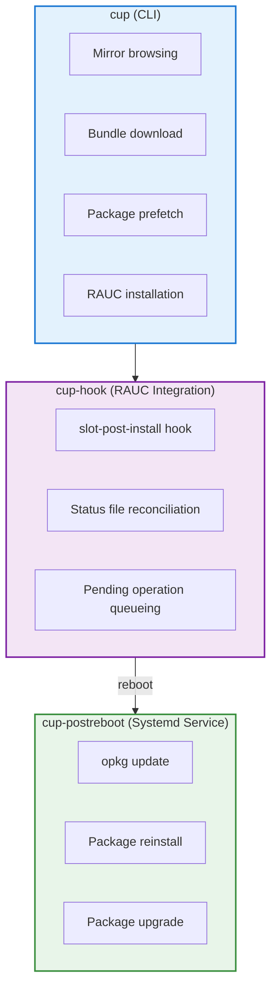

# Calculinux Update System

Developer documentation for the `calculinux-update` package and OPKG reconciliation system.

## Architecture Overview

The Calculinux update system consists of three main components:



## Module Structure

```
src/calculinux_update/
├── cli.py              # Main CLI entry point (cup command)
├── config.py           # Configuration file parsing
├── mirror.py           # Mirror browsing and bundle listing
├── installer.py        # RAUC installation and coordination
├── bundle.py           # Bundle extras extraction
├── prefetch.py         # Package prefetch before update
├── hooks.py            # RAUC hook and post-reboot entry points
└── opkg/
    ├── status.py       # OPKG status file parser
    └── reconcile.py    # Reconciliation algorithm
```

## Bundle Extras

### Overview

RAUC bundles can include additional files beyond the root filesystem image. Calculinux bundles include a `bundle-extras.tar.gz` file containing OPKG configuration and package status information from the new image. This enables the prefetch system to work correctly.

### Bundle Structure

```
bundle.raucb (squashfs)
├── manifest.raucb      # RAUC manifest
├── rootfs.img          # Root filesystem image
└── bundle-extras.tar.gz
    └── extras/
        └── opkg/
            ├── etc/
            │   └── opkg/
            │       ├── opkg.conf
            │       └── *.conf
            └── status.image
```

### Extraction Process

**Module**: `bundle.py`

The `extract_bundle_extras()` function performs a two-stage extraction:

1. **Extract tarball from bundle** - Uses `unsquashfs` to extract `bundle-extras.tar.gz` from the squashfs bundle
2. **Extract tarball contents** - Uses Python's `tarfile` module to extract the `extras/` directory structure

```python
def extract_bundle_extras(bundle_path: Path) -> Optional[BundleExtras]:
    """Extract Calculinux-specific extras from a RAUC bundle.
    
    Returns None when extras are missing. The caller is responsible for calling
    ``cleanup`` on the returned BundleExtras once finished with the temporary
    directory.
    """
    # Stage 1: Extract tarball from bundle
    subprocess.run([
        "unsquashfs", "-f", "-d", str(temp_dir),
        str(bundle_path), "bundle-extras.tar.gz"
    ])
    
    # Stage 2: Extract tarball contents
    with tarfile.open(tarball_path, "r:gz") as tar:
        tar.extractall(path=temp_dir, filter="data")
    
    # Validate and return
    if not (temp_dir / "extras/opkg/status.image").exists():
        return None
    
    return BundleExtras(root=temp_dir, opkg_root=temp_dir / "extras/opkg", ...)
```

**Security**: The extraction uses `filter="data"` (Python 3.13+) to prevent path traversal attacks.

### Bundle Extras Creation

**Yocto Recipe**: `meta-calculinux-distro/recipes-core/image/calculinux-image.bb`

The `calculinux_export_bundle_extras()` function runs during `do_rootfs`:

```bash
calculinux_export_bundle_extras() {
    extras_dir="${DEPLOY_DIR_IMAGE}/bundle-extras/extras/opkg"
    
    # Export OPKG configuration
    if [ -d "${IMAGE_ROOTFS}/etc/opkg" ]; then
        install -d "${extras_dir}/etc"
        cp -r "${IMAGE_ROOTFS}/etc/opkg" "${extras_dir}/etc/"
    fi
    
    # Export image status file
    if [ -f "${IMAGE_ROOTFS}/var/lib/opkg/status.image" ]; then
        install -d "${extras_dir}"
        install -m 0644 "${IMAGE_ROOTFS}/var/lib/opkg/status.image" \
            "${extras_dir}/status.image"
    fi
    
    # Create tarball only if we have data
    if [ "$has_data" = "1" ]; then
        tar -czf "${DEPLOY_DIR_IMAGE}/bundle-extras.tar.gz" \
            -C "${DEPLOY_DIR_IMAGE}/bundle-extras" extras
    fi
}
```

**Bundle Recipe**: `meta-calculinux-distro/recipes-core/bundles/calculinux-bundle.bb`

```bitbake
inherit bundle

RAUC_BUNDLE_EXTRA_FILES += "bundle-extras.tar.gz"
```

The `bundle` class automatically includes files listed in `RAUC_BUNDLE_EXTRA_FILES` from `DEPLOY_DIR_IMAGE`.

### Why Bundle Extras?

Without bundle extras, the prefetch system would need to:

1. Mount the inactive slot after RAUC installation
2. Access the filesystem to read OPKG configuration
3. Deal with potential mounting failures or filesystem issues

With bundle extras:

✅ Self-contained: Bundle includes all necessary metadata  
✅ No mounting required: Extracts directly from the bundle file  
✅ Offline-friendly: Works even if slots can't be mounted  
✅ Faster: No need to wait for RAUC to finish installation  

### Error Handling

If bundle extras are missing or corrupted:

```python
extras = extract_bundle_extras(bundle_path)
if not extras:
    # Graceful degradation - skip prefetch
    console.print("[yellow]Bundle extras missing, skipping prefetch[/]")
    # Installation continues normally
```

The update installation continues without prefetch, but post-reboot reconciliation will require network access.

## OPKG Reconciliation System

### The Problem

Calculinux uses a dual-layer package system:

- **Base layer**: Read-only packages in the RAUC image (`/var/lib/opkg/status.image`)
- **Overlay layer**: User-installed packages in writable storage (`/var/lib/opkg/status`)

When updating the base image, three problems arise:

1. **Shadowing**: Packages installed in overlay that now exist in the new base (duplicates)
2. **Missing packages**: Packages removed from new base that overlay packages depend on
3. **Version conflicts**: Overlay packages built against old base versions

### The Solution

The reconciliation system solves this in three phases:

#### Phase 1: Prefetch (Before Update)

**Module**: `prefetch.py`, `bundle.py`

```python
def prefetch_for_bundle(
    bundle_path: str,
    bundle_sha256: str,
    console: Optional[Console] = None
) -> PrefetchResult:
    """Pre-download packages needed for reconciliation."""
```

**Process**:

1. Extract bundle extras from the RAUC bundle
2. Load OPKG configuration and status.image from extras
3. Compute reconciliation plan against current writable status
4. Download all packages marked for reinstall using bundle's OPKG config
5. Cache packages in `/var/cache/calculinux-update/prefetch/`

**Key Implementation**:

```python
# Extract bundle extras
extras = extract_bundle_extras(bundle_path)
if not extras:
    return PrefetchResult(skipped=True, reason="bundle extras missing")

# Use extras to configure opkg downloader
downloader = OpkgDownloader(extras.opkg_root)
downloaded = downloader.download(plan.reinstall, PREFETCH_CACHE_DIR)
```

**Benefits**:

- No need to mount inactive slot during prefetch
- Self-contained: All metadata in the bundle
- Offline reconciliation capability
- Faster post-reboot (packages already cached)
- Handles network unavailability during reboot

#### Phase 2: Hook (During RAUC Install)

**Module**: `hooks.py` → `run_slot_hook()`

**RAUC Integration**:

```ini
# /etc/rauc/system.conf
[hooks]
post-install=/usr/bin/cup-hook
```

**Process**:

1. Triggered by RAUC during `slot-post-install` phase
2. Mounts newly installed slot read-only
3. Loads current writable status and new slot's status
4. Computes reconciliation plan
5. **Prunes writable status** - removes packages now in base
6. Writes pending operation files:
   - `/var/lib/opkg/opkg-status-hook.pending-reinstalls`
   - `/var/lib/opkg/opkg-status-hook.pending-upgrades`

**Key Implementation**:

```python
def run_slot_hook(slot_device: str, slot_type: str) -> bool:
    """RAUC hook for slot-post-install phase."""
    
    # 1. Mount new slot
    with TemporaryDirectory() as tmpdir:
        subprocess.run(["mount", "-o", "ro", slot_device, tmpdir])
        
        # 2. Load status files
        writable_status = load_status_entries("/var/lib/opkg/status")
        new_image_status = load_status_entries(f"{tmpdir}/var/lib/opkg/status.image")
        
        # 3. Compute plan
        plan = compute_reconcile_plan(writable_status, new_image_status)
        
        # 4. Prune writable status (remove duplicates)
        pruned_status = [e for e in writable_status if e["Package"] not in plan.remove_overlay]
        write_status_entries("/var/lib/opkg/status", pruned_status)
        
        # 5. Queue pending operations
        write_pending_file("pending-reinstalls", plan.reinstall_packages)
        write_pending_file("pending-upgrades", plan.upgrade_packages)
```

**Critical**: This phase runs in the pre-reboot environment with the new slot mounted. After this, the writable status is clean and ready for the new slot.

#### Phase 3: Post-Reboot (After Slot Switch)

**Module**: `hooks.py` → `postreboot_entrypoint()`

**Systemd Integration**:

```ini
# /lib/systemd/system/calculinux-update-postreboot.service
[Unit]
Description=Calculinux Update Post-Reboot Package Reconciliation
After=network-online.target
ConditionPathExists=/var/lib/opkg/opkg-status-hook.pending-reinstalls

[Service]
Type=oneshot
ExecStart=/usr/bin/cup-postreboot
RemainAfterExit=yes

[Install]
WantedBy=multi-user.target
```

**Process**:

1. Runs on first boot into new slot (triggered by pending files)
2. Updates opkg package feeds (`opkg update`)
3. Reinstalls packages removed from base:
   ```python
   for pkg in plan.reinstall_packages:
       opkg("install", pkg)  # Prefers cached .ipk if available
   ```
4. Upgrades overlay packages to match new base:
   ```python
   for pkg in plan.upgrade_packages:
       opkg("upgrade", pkg)
   ```
5. Cleans up pending files

**Key Implementation**:

```python
def postreboot_entrypoint() -> int:
    """Post-reboot package reconciliation."""
    
    # Load pending operations
    reinstalls = read_pending_file("pending-reinstalls")
    upgrades = read_pending_file("pending-upgrades")
    
    # Update feeds
    run_opkg_command(["update"])
    
    # Reinstall missing packages
    for pkg in reinstalls:
        cached_ipk = _find_cached_package(pkg)
        if cached_ipk:
            run_opkg_command(["install", cached_ipk])
        else:
            run_opkg_command(["install", pkg])
    
    # Upgrade overlay packages
    for pkg in upgrades:
        run_opkg_command(["upgrade", pkg])
    
    # Cleanup
    remove_pending_files()
```

**Cache Preference**: The system prefers prefetched `.ipk` files from `/var/cache/calculinux-update/opkg-cache/` for offline operation.

### Reconciliation Algorithm

**Module**: `reconcile.py`

**Core Function**:

```python
@dataclass
class ReconcilePlan:
    """Plan for reconciling overlay packages with new base image."""
    remove_overlay: List[str]      # Packages now in base (duplicates)
    reinstall_packages: List[str]  # Missing packages to reinstall
    upgrade_packages: List[str]    # Overlay packages to upgrade

def compute_reconcile_plan(
    writable_status: List[StatusEntry],
    new_image_status: List[StatusEntry]
) -> ReconcilePlan:
    """Compute what needs to change in writable status."""
```

**Algorithm**:

1. **Identify duplicates** - packages in both writable and new image:
   ```python
   writable_pkgs = {e["Package"] for e in writable_status}
   new_image_pkgs = {e["Package"] for e in new_image_status}
   remove_overlay = list(writable_pkgs & new_image_pkgs)
   ```

2. **Find missing packages** - packages removed from new image:
   ```python
   old_image_status = load_status_entries("/var/lib/opkg/status.image")
   old_image_pkgs = {e["Package"] for e in old_image_status}
   missing_from_new = old_image_pkgs - new_image_pkgs
   
   # Only reinstall if writable packages depend on them
   reinstall = []
   for pkg in missing_from_new:
       if any(pkg in get_dependencies(w) for w in writable_status):
           reinstall.append(pkg)
   ```

3. **Identify upgrades needed** - overlay packages that may conflict:
   ```python
   upgrade_packages = []
   for entry in writable_status:
       pkg_name = entry["Package"]
       if pkg_name not in remove_overlay:  # Not a duplicate
           upgrade_packages.append(pkg_name)
   ```

**Why upgrade everything?**: Overlay packages were compiled against the old base. The new base may have updated shared libraries or APIs. Upgrading ensures ABI compatibility.

### Status File Parsing

**Module**: `status.py`

**Format**: OPKG status files use a paragraph-based format (like Debian control files):

```
Package: foo
Version: 1.0-r0
Depends: libbar (>= 2.0)
Status: install user installed
Architecture: cortexa9t2hf-neon

Package: bar
...
```

**Key Functions**:

```python
def load_status_entries(status_path: str) -> List[StatusEntry]:
    """Parse status file into list of package entries."""
    # Returns list of dicts, one per package

def write_status_entries(status_path: str, entries: List[StatusEntry]) -> None:
    """Write entries back to status file."""
    # Preserves original format and field order

def _iter_paragraphs(file: TextIO) -> Iterator[List[str]]:
    """Iterate over paragraph blocks in status file."""
    # Handles blank lines, comments, continuations
```

**Robustness**:

- Handles missing files (returns empty list)
- Preserves field order when round-tripping
- Respects blank lines between entries
- Case-insensitive field lookup

## Configuration

**Module**: `config.py`

**File**: `/etc/calculinux-update.toml`

```python
@dataclass
class ChannelConfig:
    name: str
    path: str
    enable: bool = True

@dataclass
class AppConfig:
    mirror_base_url: str
    channels: List[ChannelConfig]
    cache_dir: str = "/var/cache/calculinux-update"

def load_config() -> AppConfig:
    """Load config from /etc or fallback to package defaults."""
```

**Configuration Resolution**:

1. Try `/etc/calculinux-update.toml` (system config)
2. Fall back to `src/calculinux_update/defaults/calculinux-update.toml`
3. Merge channels (system config channels override defaults by name)

## Mirror Browsing

**Module**: `mirror.py`

**Structure**:

```python
@dataclass
class BundleInfo:
    filename: str
    timestamp: datetime
    size: int
    sha256: Optional[str] = None

def list_bundles_for_channel(
    channel: ChannelConfig,
    base_url: str
) -> List[BundleInfo]:
    """List available bundles from mirror channel."""
    # Fetches channel/bundles.txt
    # Parses bundle metadata
    # Sorts by timestamp (newest first)
```

**Bundles Metadata** (`bundles.txt`):

```
# timestamp filename size sha256
1732147200 calculinux-bundle-20241120.raucb 123456789 abc123...
1731542400 calculinux-bundle-20241113.raucb 123456780 def456...
```

**Download**:

```python
def download_bundle(
    bundle: BundleInfo,
    channel: ChannelConfig,
    base_url: str,
    destination: str,
    verify_checksum: bool = True
) -> bool:
    """Download bundle from mirror with optional verification."""
```

## Installation Flow

**Module**: `installer.py`

**Main Orchestrator**:

```python
def install_update_interactive(
    config: AppConfig,
    channel_name: Optional[str] = None,
    bundle_name: Optional[str] = None,
    dry_run: bool = False,
    prefetch: bool = True,
    require_confirmation: bool = True
) -> bool:
    """Interactive update installation with prefetch."""
```

**Process**:

1. **Select channel** - prompt if not specified
2. **List bundles** - from mirror, sorted newest first
3. **Select bundle** - prompt if not specified
4. **Prefetch packages** - if enabled and not dry-run
5. **Download bundle** - to cache directory
6. **Confirm installation** - if required
7. **Invoke RAUC** - `rauc install <bundle>`

**RAUC Integration**:

```python
def install_with_rauc(bundle_path: str) -> bool:
    """Install bundle using RAUC."""
    result = subprocess.run(
        ["rauc", "install", bundle_path],
        capture_output=True,
        text=True
    )
    return result.returncode == 0
```

## Testing

### Test Structure

```
tests/
├── test_cli.py             # CLI argument parsing and commands
├── test_config.py          # Configuration loading
├── test_mirror.py          # Mirror browsing and downloads
├── test_installer.py       # Installation orchestration
├── test_opkg_status.py     # Status file parsing
├── test_opkg_reconcile.py  # Reconciliation algorithm
├── test_hooks.py           # Hook and post-reboot logic
└── test_prefetch.py        # Package prefetch
```

### Key Testing Principles

**Avoid Brittleness**:

```python
# ❌ BAD: Too specific, fragile
def test_find_booted_device(mock_run):
    mock_run.return_value = MagicMock(stdout="/dev/mmcblk0p1")
    device = find_booted_device()
    assert device == "/dev/mmcblk0p1"  # Breaks if device changes

# ✅ GOOD: Checks behavior, not exact values
def test_find_booted_device(mock_run):
    mock_run.return_value = MagicMock(stdout="/dev/mmcblk0p1")
    device = find_booted_device()
    assert device.startswith("/dev/")  # Flexible
    assert len(device) > 0
```

**Test Behavior, Not Implementation**:

```python
# ❌ BAD: Tests exact argument order
def test_install_pkg(mock_run):
    install_package("foo")
    mock_run.assert_called_with(["opkg", "install", "foo"])

# ✅ GOOD: Tests that package is installed
def test_install_pkg(mock_run):
    install_package("foo")
    args = mock_run.call_args[0][0]
    assert "install" in args
    assert "foo" in args
```

### Running Tests

```bash
# All tests with coverage
pytest --cov=calculinux_update --cov-report=term-missing

# Specific module
pytest tests/test_hooks.py -v

# Coverage threshold (CI)
pytest --cov=calculinux_update --cov-fail-under=80
```

**Current Coverage**: ~84% (above 80% threshold)

### Mocking External Commands

**RAUC**:

```python
@patch("subprocess.run")
def test_rauc_install(mock_run):
    mock_run.return_value = MagicMock(returncode=0)
    result = install_with_rauc("/tmp/bundle.raucb")
    assert result is True
    assert any("rauc" in str(call) for call in mock_run.call_args_list)
```

**OPKG**:

```python
@patch("subprocess.run")
def test_opkg_update(mock_run):
    mock_run.return_value = MagicMock(returncode=0, stdout="Updated 3 feeds")
    run_opkg_command(["update"])
    assert mock_run.called
```

## Integration Points

### RAUC

**Configuration**: `/etc/rauc/system.conf`

```ini
[hooks]
post-install=/usr/bin/cup-hook
```

**Hook Environment Variables**:

- `RAUC_SLOT_DEVICE` - Block device of newly installed slot (e.g., `/dev/mmcblk0p2`)
- `RAUC_SLOT_TYPE` - Slot type (`rootfs`)
- `RAUC_SLOT_NAME` - Slot identifier (`rootfs.1`)

### Systemd

**Service File**: `/lib/systemd/system/calculinux-update-postreboot.service`

**Activation**: Triggered by `ConditionPathExists` on pending files.

**Ordering**:

- `After=network-online.target` - Ensures network for opkg update
- `Type=oneshot` - Runs once and exits
- `RemainAfterExit=yes` - Marks as successful after completion

### OPKG

**Configuration**: `/etc/opkg/opkg.conf`

```
src/gz calculinux http://feeds.example.com/release
dest root /
lists_dir ext /var/lib/opkg/lists
```

**Key Paths**:

- `/var/lib/opkg/status` - Current installed packages (writable)
- `/var/lib/opkg/status.image` - Base image packages (read-only)
- `/var/lib/opkg/lists/` - Package feed metadata
- `/var/cache/calculinux-update/opkg-cache/` - Prefetched .ipk files

## Error Handling

### Prefetch Failures

**Scenario**: opkg not configured, no network, missing feeds

**Handling**:

```python
def prefetch_for_bundle(...) -> bool:
    try:
        # Attempt download
        return downloader.download_packages(packages)
    except Exception as e:
        logger.warning(f"Prefetch failed: {e}")
        logger.warning("Continuing without prefetch - network required after reboot")
        return False
    # Install proceeds regardless
```

**User Impact**: Post-reboot reconciliation requires network if prefetch fails.

### Hook Failures

**Scenario**: Can't mount slot, status parsing fails, write failures

**Handling**:

```python
def run_slot_hook(...) -> bool:
    try:
        # Mount, reconcile, prune, queue
        return True
    except Exception as e:
        logger.error(f"Hook failed: {e}")
        logger.error("Reconciliation may be incomplete")
        return False
    # RAUC install continues (slot is valid even if hook fails)
```

**User Impact**: May have duplicate packages or conflicts after reboot. Manual intervention required (`opkg remove <pkg>`).

### Post-Reboot Failures

**Scenario**: Network unavailable, missing packages, opkg failures

**Handling**:

```python
def postreboot_entrypoint() -> int:
    try:
        # Update feeds, reinstall, upgrade
        remove_pending_files()
        return 0
    except Exception as e:
        logger.error(f"Post-reboot failed: {e}")
        # Leave pending files for retry
        return 1
```

**User Impact**: Service fails, pending files remain. User can:

1. Fix network/feeds and `systemctl restart calculinux-update-postreboot`
2. Manually reconcile with `opkg`
3. Roll back to previous slot

## Performance Considerations

### Prefetch Optimization

- **Parallel downloads**: Consider `asyncio` or threads for multiple packages
- **Delta updates**: RAUC supports delta bundles (not currently implemented)
- **Cache cleanup**: Old prefetched packages can accumulate

### Mount Operations

- **Read-only mounts**: Hook mounts slots read-only (safe)
- **Unmount cleanup**: Use `try/finally` or `with TemporaryDirectory()`
- **Device detection**: `findmnt` is fast, fallback to `/proc/cmdline` parsing

### Status File Size

- **Typical size**: A few hundred KB (hundreds of packages)
- **Parse time**: <100ms even for large status files
- **Memory usage**: Status entries held in memory during reconciliation

## Future Enhancements

### Planned Features

1. **Delta bundles** - Smaller downloads for incremental updates
2. **Rollback detection** - Detect and skip reconciliation if rolling back to known slot
3. **Cache cleanup** - Automatic cleanup of old prefetched packages
4. **Metrics** - Report reconciliation statistics (packages pruned, reinstalled, upgraded)
5. **Dry-run reconciliation** - Preview reconciliation plan before install

### Architecture Improvements

1. **Async downloads** - Speed up prefetch with concurrent downloads
2. **Dependency resolution** - Smarter reinstall logic based on actual dependencies
3. **Version pinning** - Option to prevent automatic upgrades of specific packages
4. **Custom hooks** - Allow site-specific pre/post reconciliation scripts

## Debugging

### Enable Debug Logging

Set `LOGLEVEL` environment variable:

```bash
LOGLEVEL=DEBUG cup install
LOGLEVEL=DEBUG cup-hook /dev/mmcblk0p2 rootfs
LOGLEVEL=DEBUG cup-postreboot
```

### Inspect Status Files

```bash
# Current writable status
cat /var/lib/opkg/status

# Base image status
cat /var/lib/opkg/status.image

# Pending operations
cat /var/lib/opkg/opkg-status-hook.pending-reinstalls
cat /var/lib/opkg/opkg-status-hook.pending-upgrades
```

### Manual Reconciliation

```bash
# Simulate hook
sudo cup-hook /dev/mmcblk0p2 rootfs

# Simulate post-reboot
sudo cup-postreboot

# Manually prune duplicates
sudo opkg remove <package>

# Manually upgrade all
sudo opkg upgrade
```

### Test Reconciliation Plan

```python
from calculinux_update.opkg.status import load_status_entries
from calculinux_update.opkg.reconcile import compute_reconcile_plan

writable = load_status_entries("/var/lib/opkg/status")
new_image = load_status_entries("/mnt/newslot/var/lib/opkg/status.image")
plan = compute_reconcile_plan(writable, new_image)

print(f"Remove: {plan.remove_overlay}")
print(f"Reinstall: {plan.reinstall_packages}")
print(f"Upgrade: {plan.upgrade_packages}")
```

## References

- [RAUC Documentation](https://rauc.readthedocs.io/)
- [OPKG Package Manager](https://openwrt.org/docs/guide-user/additional-software/opkg)
- [Yocto Project](https://www.yoctoproject.org/)
- [Systemd Service Units](https://www.freedesktop.org/software/systemd/man/systemd.service.html)

---

*For user-facing documentation, see [User Guide: System Updates](../user-guide/updates.md)*
