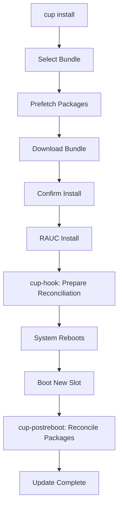

# System Updates

Calculinux uses a dual-layer update strategy combining RAUC for system images and OPKG for packages, with automatic reconciliation to keep everything in sync.

## Overview

Calculinux employs an A/B slot update system powered by RAUC (Robust Auto-Update Controller). When you install an update, it writes to the inactive slot, leaving your current system untouched. After reboot, the system switches to the new slot, and the old one becomes your rollback option.

### Update Architecture

```
┌─────────────────────────────────────────┐
│  Read-Only Base Image (RAUC Slot)       │
│  ├─ Kernel                              │
│  ├─ Base System Packages                │
│  └─ /var/lib/opkg/status.image          │
└─────────────────────────────────────────┘
              ↓
┌─────────────────────────────────────────┐
│  Writable Overlay                       │
│  ├─ User-Installed Packages             │
│  ├─ Configuration Files                 │
│  └─ /var/lib/opkg/status                │
└─────────────────────────────────────────┘
```

### The Calculinux Update Tool (`cup`)

The `calculinux-update` package provides the `cup` command for managing system updates. Two additional internal commands (`cup-hook` and `cup-postreboot`) are automatically invoked by the system during the update process—you typically won't need to run these manually.

## Installing Updates

### Interactive Update

The easiest way to update is interactively:

```bash
sudo cup install
```

This will:

1. List available channels (if you have multiple enabled)
2. Show available bundles sorted by date (newest first)
3. Let you select which bundle to install
4. Prefetch packages that will be reinstalled after reboot
5. Prompt for confirmation before installing

### Update Specific Channel

```bash
sudo cup install --channel "Release"
```

### Update with Specific Bundle

If you know the bundle name:

```bash
sudo cup install --bundle calculinux-bundle-walnascar-20251120.raucb
```

### Non-Interactive Update

For automation or when you're confident:

```bash
sudo cup install --bundle <name> --yes
```

## Listing Available Updates

### List All Updates

```bash
cup list
```

### List Updates from Specific Channel

```bash
cup list --channel "Continuous"
```

## Download Without Installing

To download a bundle without installing (useful for offline installation later):

```bash
cup download --bundle <name>
```

By default, bundles are downloaded to `/var/cache/calculinux-update/`.

## Package Reconciliation

### Why Reconciliation Matters

Calculinux uses a dual-layer package system:

- **Base layer**: System packages baked into the read-only RAUC image
- **Overlay layer**: User-installed packages stored in writable storage

When you update the base image, this can create problems:

1. **Duplicate packages**: A package you installed is now in the new base image
2. **Missing packages**: The new image removed a package your other packages depend on
3. **Version conflicts**: Your overlay packages conflict with newer base versions

### Automatic Reconciliation

The update process automatically handles these issues:

#### During Update Installation

When you run `sudo cup install`, the system:

1. **Prefetches packages** - Downloads packages that will need reinstallation
2. **Plans reconciliation** - Identifies duplicates, missing packages, and upgrades needed

#### During RAUC Installation (via `cup-hook`)

When RAUC installs the new slot:

1. **Removes duplicates** - Uninstalls overlay packages now provided by the base
2. **Records the plan** - Saves which packages need reinstalling/upgrading
3. **Prepares for reboot** - Everything is ready for the post-reboot phase

#### After Reboot (via `cup-postreboot`)

When the system boots into the new slot:

1. **Updates package feeds** - Runs `opkg update`
2. **Reinstalls missing packages** - Installs packages from the old base now missing
3. **Upgrades overlay packages** - Updates all user packages to match new base versions
4. **Uses cached packages** - Prefers locally cached .ipk files for offline operation

### Checking Reconciliation Status

After an update, check the systemd journal:

```bash
journalctl -u calculinux-update-postreboot.service
```

Look for messages like:

```
cup-hook: pruned writable status against new image
cup-hook: queued 3 packages for reinstall
cup-hook: queued 5 packages for upgrade
```

## Configuration

### Update Channels

Edit `/etc/calculinux-update.toml`:

```toml
[[channels]]
name = "Release"
path = "/update/walnascar/release"
enable = true

[[channels]]
name = "Continuous"
path = "/update/walnascar/continuous"
enable = false

[[channels]]
name = "Builds"
path = "/update/walnascar/pr"
enable = false
```

Set `enable = true` to show a channel in `cup list`.

### Skipping Prefetch

In some cases you might want to skip prefetch:

```bash
sudo cup install --no-prefetch
```

!!! warning
    Without prefetch, post-reboot reconciliation requires network access.

## Update Process Flow



## Troubleshooting

### Update Fails to Install

Check RAUC status:

```bash
rauc status
```

View detailed logs:

```bash
journalctl -u rauc -e
```

### Packages Not Reconciling After Reboot

Check the post-reboot service:

```bash
systemctl status calculinux-update-postreboot.service
journalctl -u calculinux-update-postreboot.service -e
```

Pending operations are stored in:

- `/var/lib/opkg/opkg-status-hook.pending-reinstalls`
- `/var/lib/opkg/opkg-status-hook.pending-upgrades`

### Prefetch Fails

This usually means opkg isn't configured, though it should be configured out of the box. You can:

1. Skip prefetch: `sudo cup install --no-prefetch`
2. Ensure network access is available after reboot
3. Check opkg configuration: `cat /etc/opkg/opkg.conf`

### Rolling Back an Update

RAUC maintains the previous slot as a fallback:

```bash
# Mark current slot as bad and reboot to previous
sudo rauc status mark-bad booted
sudo reboot
```

Or select the other slot in your bootloader (if supported).

!!! warning "Package State After Rollback"
    After rolling back, some manually installed packages may need to be reinstalled, as the reconciliation system currently only runs during forward updates. A list of your installed packages can help:
    
    ```bash
    # Before updating, save your package list
    opkg list-installed > ~/my-packages.txt
    
    # After rollback, reinstall if needed
    cat ~/my-packages.txt | awk '{print $1}' | xargs opkg install
    ```
    
    Future versions will include automatic rollback detection and reconciliation.

### Dry Run

Test the update process without actually installing:

```bash
cup install --dry-run
```

This downloads and prepares but doesn't invoke RAUC.

## Best Practices

### Before Updating

1. **Check free space**: Ensure `/var/cache` has room for downloads
2. **Backup critical data**: Though updates are safe, backups are always good
3. **Note your packages**: `opkg list-installed > my-packages.txt`

### After Updating

1. **Check reconciliation**: `journalctl -u calculinux-update-postreboot.service`
2. **Test your applications**: Ensure everything still works
3. **Keep previous slot**: Don't mark it bad until you're confident

### For Development Machines

Use `--no-prefetch` and ensure network access:

```bash
sudo cup install --no-prefetch
```

## Advanced Usage

### Testing PR Builds

Enable the Builds channel and install PR bundles:

```bash
# Edit /etc/calculinux-update.toml, set Builds enable = true
cup list --channel "Builds"
sudo cup install --channel "Builds" --bundle calculinux-pr123.raucb
```

### Automated Updates

For kiosk or embedded deployments:

```bash
#!/bin/bash
# Update to latest release automatically
BUNDLE=$(cup list --channel "Release" | head -1 | awk '{print $1}')
if [ -n "$BUNDLE" ]; then
    sudo cup install --channel "Release" --bundle "$BUNDLE" --yes
fi
```

### Custom Mirrors

Set `mirror_base_url` in `/etc/calculinux-update.toml`:

```toml
mirror_base_url = "https://my-mirror.example.com"
```

## Related Topics

- [Package Management](package-management.md) - Installing and managing packages with opkg
- [Configuration](configuration.md) - System configuration files
- [Boot Problems](../troubleshooting/boot-problems.md) - Recovering from boot issues
- [RAUC Documentation](https://rauc.readthedocs.io/) - Upstream RAUC docs

---

*For developers working on the update system, see [Developer Guide: Calculinux Update](../developer/calculinux-update.md)*
